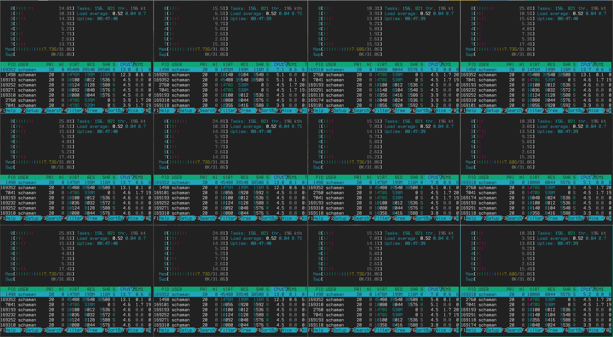

# hyprgrid

Hyprland scripts for spawning tiled terminal grids — literal N×M matrices of equal-size windows via dwindle tree manipulation. No floating.



## Architecture

```
bin/
├── grid          # core: N×M identical terminals
├── grid-ssh      # SSH grid: one host per cell, auto-balanced to ~16:9
└── grid-hosts    # SSH grid for ssh-config Host aliases matching a regex
```

## How it works

Requires Hyprland 0.56 with a Lua config — all `hyprctl` calls use the `hl.dsp.*` / `hl.config` API.

1. **Prep:** abort unless the current workspace has no tiled windows; disable `input.follow_mouse` and `animations.enabled` for the build.
2. **Bands:** spawn a seed window, then split it downward ROWS-1 times. After each split the new bottom window is shrunk with a relative `window.resize` so all ROWS bands end up equal height.
3. **Columns:** split every band rightward COLS-1 times the same way, so all COLS columns end up equal width.
4. **Restore** `follow_mouse` / `animations.enabled` to the values declared in `hyprland.lua` (also on Ctrl-C).

Focus is tracked by window address. There are no fixed sleeps: the scripts poll for each new window to map and for the geometry to settle after a resize. A 3×3 grid builds in about 2 s.

Tested layouts: 2×2, 2×3, 3×2, 3×3, 3×5, 4×2, 4×4, 5×3, 6×6 — all equal within 5px.

## Scripts

### `grid [COLS] [ROWS] [CMD]`

Defaults: 3 columns, 3 rows, alacritty.

```bash
grid                # 3×3 alacritty
grid 5 2 foot       # 5×2 foot terminals
grid 4 3 "alacritty -e htop"
```

### `grid-ssh HOST...`

One SSH terminal per host, placed left to right, top to bottom. Grid dimensions are chosen to minimize empty cells, then to stay close to 16:9. Empty cells get a plain terminal.

### `grid-hosts [-n] PATTERN [FILE]`

Collects the `Host` aliases in an ssh config file (default `~/.ssh/config`) that match the awk regex `PATTERN`, skipping wildcard aliases, and opens them with `grid-ssh`. `-n` only lists the matches.

```bash
grid-hosts '^web-'
grid-hosts -n 'db[0-9]$' ~/.ssh/config.d/prod
```

For a fixed host group, wrap it in a private script or alias outside the repo:

```bash
alias grid-web="grid-hosts '^web-' ~/.ssh/config.d/web"
```

## Requirements

- Hyprland ≥ 0.56 with a Lua config, `hyprctl`, `jq`, `awk`
- `alacritty` (default), `ssh` (grid-ssh, grid-hosts)
- Run on an empty workspace (no tiled windows).
